| No дефекта | Описание дефекта                                                                                                           | Серьезность | Приоритет                                                                                                                          | Скриншот                          | Комментарий                                                                                                                                                               |
|------------|----------------------------------------------------------------------------------------------------------------------------|-------------|------------------------------------------------------------------------------------------------------------------------------------|-----------------------------------|---------------------------------------------------------------------------------------------------------------------------------------------------------------------------|
| 1          | Значение каунтера найденных объявлений в заголовке страницы не совпадает со значениями в каунтере кнопки поиска в фильтре. | major       | high Создает негативное впечатление о компетенциях компании.                                                                   | 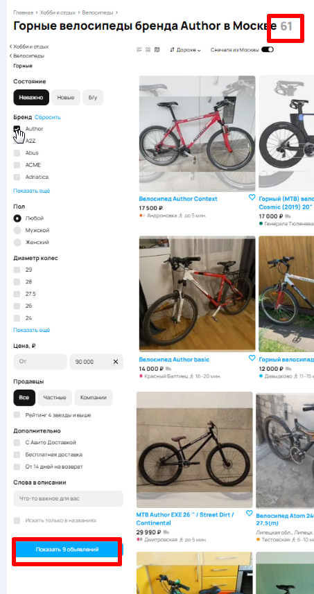   |                                                                                                                                                                           |
| 2          | Значение каунтера найденных объявлений в заголовке страницы не совпадает со количеством страниц в пагинации.               | critical    | ASAP    Негативное впечатление. При работе пользователя с пагинацией могут возникнуть ошибки и некорректное поведение сервиса. | 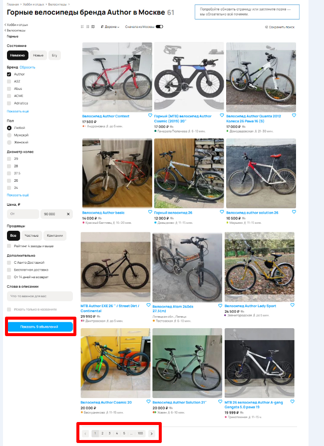  | На странице результатов в режиме "плитки" обычно выводится 24 результата. 100 страниц, отображаемых в пагинации, содержат явно большее количество результатов, чем 9. |
| 3          | Неопределенная ошибка в UI на странице поиска.                                                                             | medium      | normal Серьезность и приоритет могут быть изменены после локализации ошибки.                                                   | 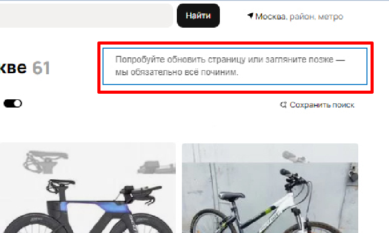  | Требуются уточнения по причинам возникновения. Как минимум информация из DevTools.                                                                                        |
| 4          | Кнопка "Все категории" не вмещает в себя название кнопки. Заливка кнопки выполнена не в голубом цвете.                     | minor       | high      Создает негативное впечатление о компетенциях компании.                                                              |   |                                                                                                                                                                           |
| 5          | Заливка кнопки "Найти" выполнена не в голубом цветех.                                                                      | minor       | high      Создает негативное впечатление о компетенциях компании.                                                              | 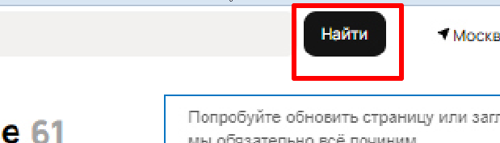  |                                                                                                                                                                           |
| 6          | В геолокаторе области поиска отсутствует слово "радиус". Вместо иконки балуна отображается иконка стрелки.                 | minor       | normal                                                                                                                             | 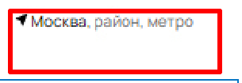  |                                                                                                                                                                           |
| 7          | Количество результатов на странице не совпадает со значением каунтера кнопки.                                              | major       | high Т.о. можно заключить, что функциональность не корректно отрабатывает запрос.                                              | 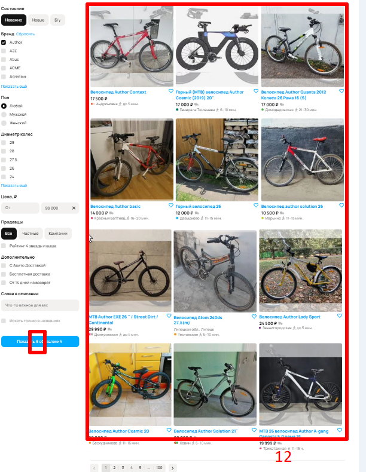  |                                                                                                                                                                           |
| 8          | "Хлебные крошки" не корректно отображают структуру страницы.                                                               | medium      | normal Функциональность работает не так, как задумано.                                                                         | 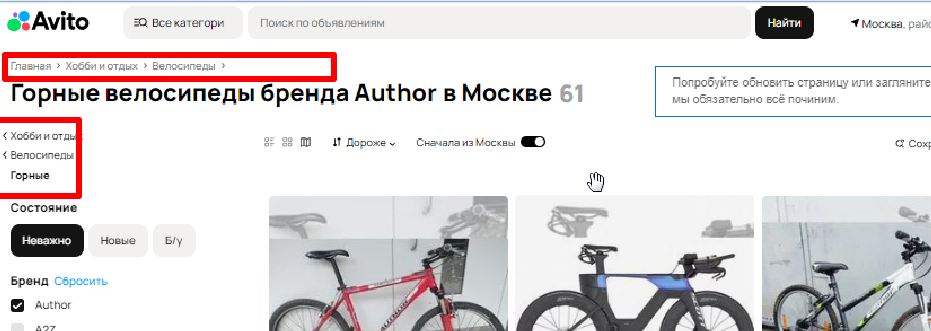  | Судя по настройкам фильтра в "хлебных крошках" необходимо отображать "Главная>Хобби и отдых>Велосипеды>Горные"     .                                                      |
| 9          | Сортировка по цене неправильно сортирует результаты выдачи.                                                                | major       | high Пользователю будет не удобно работать с выдачей, что отразится на удовлетворенности сервисом.                             | 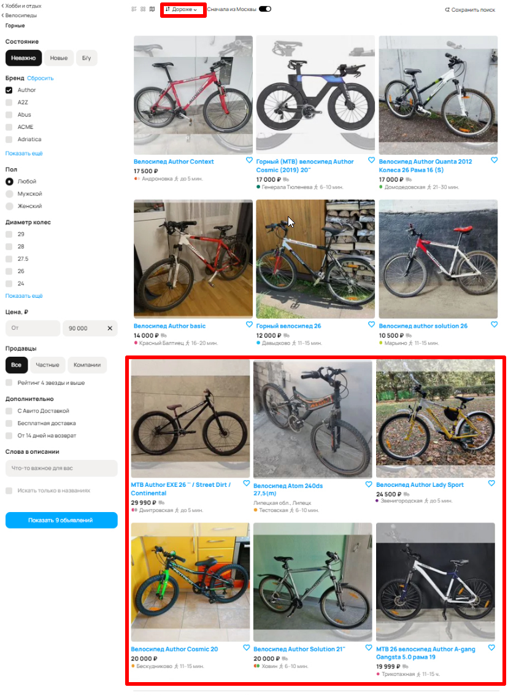  | Выделенные результаты, по логике сортировки "Дороже", должны находиться вверху выдачи.                                                                                    |
| 10         | Не работает переключение в режим отображения "Карта".                                                                      | major       | ASAP   Часть функциональности не работает.  Создает негативное впечатление о компетенциях компании.                            | 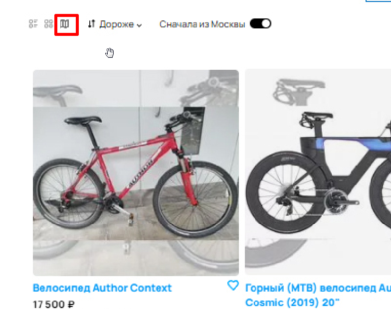  | На скрине включен режим "Карта". Результаты же отображаются в режиме "Плитка".                                                                                            |
| 11         | Не существующая станция метро отображается в карточках результатов.                                                        | medium      | normal Есть возможность обойти дефект: уточнить локацию у продавца.                                                            | 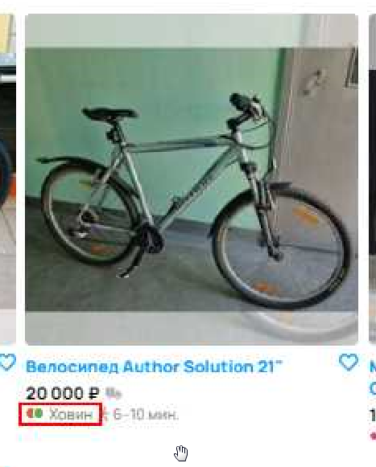 | Требуется уточнить, имеет ли место опечатка или действительно добавлена несуществующая станция.                                                                           |
| 12         | Не существующая станция метро отображается в карточках результатов.                                                        | medium      | normal Есть возможность обойти дефект: уточнить локацию у продавца.                                                            | 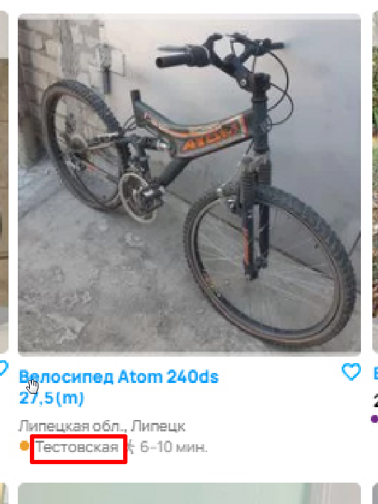 |                                                                                                                                                                           |
| 13         | Карточки результатов расположены на разных уровнях.                                                                        | minor       | minor                                                                                                                              | 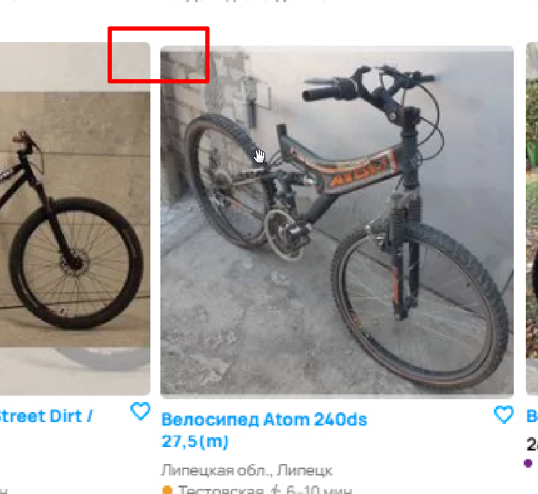 |                                                                                                                                                                           |
| 14         | В результатах выдачи присутствует населенный пункт не из области поиска.                                                   | critical    | ASAP Функциональсть не корректно отрабатывает условия поиска.                                                                  | 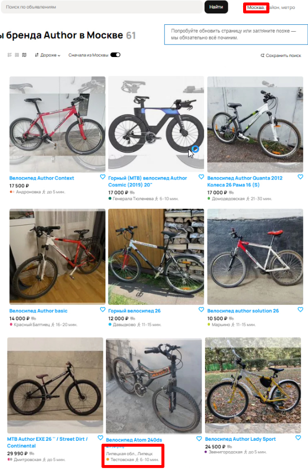 | Липецк не является Москвой.                                                                                                                                               |
| 15         | Не корректное отображение времени прибытия в карточке.                                                                     | medium      | normal Есть возможность обойти дефект: уточнить локацию у продавца.                                                            |  |                                                                                                                                                                           |
| 16         | Отсутствует информация о цене в карточке товара.                                                                           | medium      | normal Есть возможность обойти дефект: уточнить цену у продавца.                                                               | 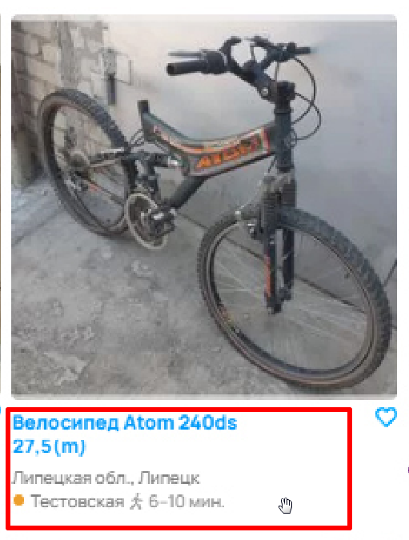 | Уточнить поведение системы, когда продавец не указал стоимость товара. Насколько я помню, должно отображаться "Цена не указана".                                          |

